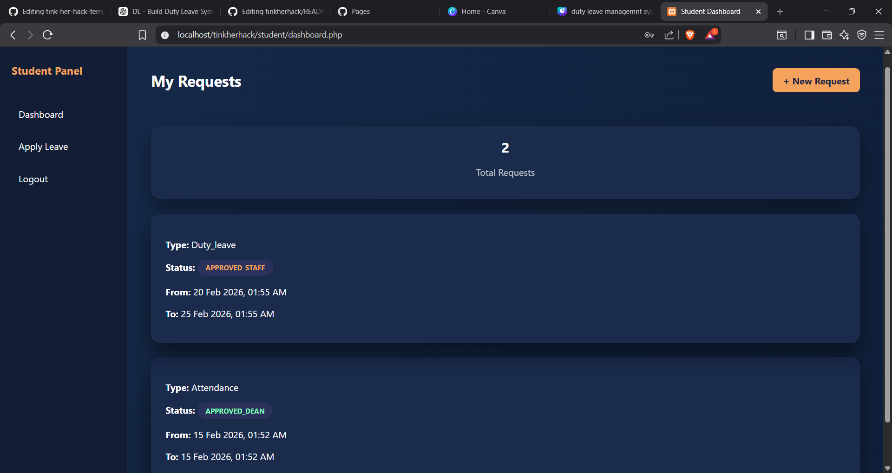
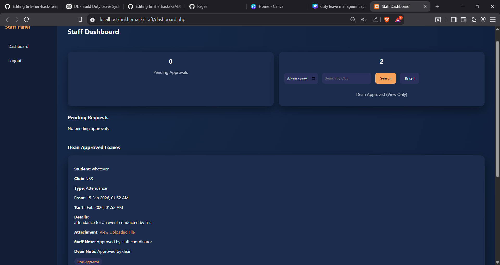
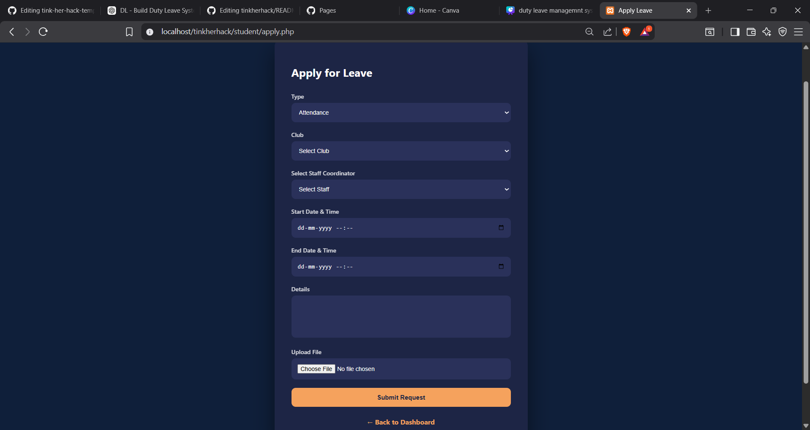
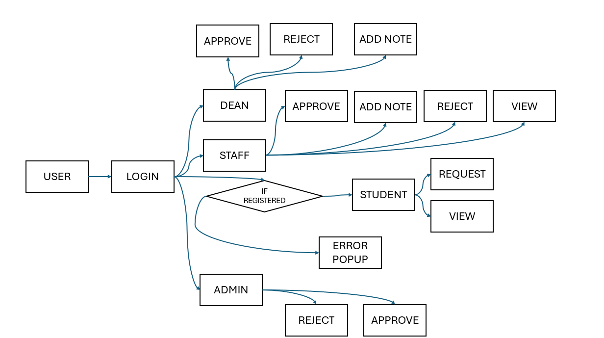

<p align="center">
  
</p>

#DUTY LEAVE MANAGEMENT SYSTEM

## Basic Details

### Participationg as an individual

### Team Members
- Member 1: Meera Suresh - LBS Institute of Technology for Women, Poojapura


### Hosted Project Link

### Project Description
Duty Leave Management System is a role-based web application designed to digitize and streamline the leave approval process in educational institutions. The system enables students such as Class Representatives and Execom members to submit duty leave requests with supporting documents, which then go through structured approval stages involving designated staff members and the dean. An admin verifies user roles to prevent misuse and ensure proper authorization. The platform improves transparency, reduces manual paperwork, ensures accountability at every approval level, and provides a centralized dashboard for tracking leave status in real time.

### The Problem statement
Duty leave and attendance approvals in many institutions are still managed manually, leading to delays, lack of transparency, and poor record maintenance. There is no structured system to ensure that only authorized students apply and that approvals follow a proper hierarchy. A secure, role-based digital solution is needed to streamline the workflow and maintain accountability.

### The Solution
A role-based web application that:
* Automates approvals
* Ensures accountability
* Restricts misuse
* Tracks status at every level

---

Languages used: PHP, HTML5, CSS3, JavaScript, SQL

Frameworks used: None (Built using core PHP and native web technologies)

Libraries used: PHP password hashing functions (password_hash, password_verify), MySQLi for database interaction

Tools used: VS Code, XAMPP (Apache & MySQL), phpMyAdmin, Git, GitHub


---

## Features

List the key features of your project:
* Multi-level approval:
Requests go through multiple stages of validation. A leave request is first reviewed by the designated staff advisor and, if approved, is then forwarded to the dean for final approval. This ensures accountability and prevents unilateral decision-making.
* Role-based authentication:
  Users are granted access based on their assigned roles such as student (class rep or execom), staff, dean, and admin. Each role has specific permissions and restricted dashboards, preventing unauthorized access to sensitive actions.
* Admin verification of students:
  Newly registered students remain in a pending state until verified by the admin. Only after approval can they access the system and perform actions such as applying for leave, ensuring misuse is minimized.
* Mandatory document upload:
  Students must upload supporting documents when submitting a leave request. This prevents unsupported claims and ensures that every request is backed by valid proof before being reviewed.
* Search by club/date:
  Staff members can filter and search dean-approved leaves based on club name or specific dates. This improves traceability and makes record retrieval faster and more organized.
* Delete before approval:
Students can delete their submitted request only while it is still pending staff approval. Once reviewed, deletion is restricted to maintain integrity and audit consistency.
* Secure password hashing:
  Passwords are never stored in plain text. The system uses secure hashing mechanisms to encrypt passwords before storing them in the database, ensuring user credentials remain protected even if the database is compromised.

---

## Implementation

### For Software:

### Dependencies

* Windows 10 or later (or any OS capable of running Apache and MySQL)
* XAMPP (Apache and MySQL)
* PHP 8.x recommended
* MySQL 5.7 or later
* Web browser (Chrome, Edge, Firefox)

### Installing

* Download or clone the repository into your XAMPP `htdocs` folder
C:\xampp\htdocs\tinkherhack
* Start Apache and MySQL from XAMPP Control Panel
* Open phpMyAdmin
* Create a new database (for example: duty_leave_db)
* Import the provided SQL file or manually create required tables
* Configure database connection in:

Update database credentials if required.

### Executing program

* Start Apache and MySQL in XAMPP
* Open browser
* Navigate to:
http://localhost/tinkherhack/
* Log in using sample admin, staff, or dean credentials
* Register a new student and approve via admin panel
* Submit and process leave requests through workflow

## Project Documentation


#### Screenshots


Displays all leave requests submitted by the student along with their current approval status. Students can view request type, duration, and track whether it is approved by staff or dean.

Shows pending leave requests assigned to the staff for approval and a separate section to view all dean-approved leaves. Staff can review full request details, including attachments and notes.

Form interface where students submit new leave requests by selecting type, club, staff coordinator, date range, adding details, and uploading mandatory supporting documents.
#### Diagrams

**Application Workflow:**


*Add caption explaining your workflow*

## Additional Documentation

### For Web Projects with Backend:

#### API Documentation

##### Endpoints

**GET /api/requests**
- **Description:** Fetch all leave requests for the logged-in user (student/staff/dean based on role).
- **Parameters:**
  - `role` (string): User role (`class_rep`, `execom`, `staff`, `dean`)
  - `status` (string, optional): Filter requests by status (`pending_staff`, `approved_staff`, `approved_dean`, `rejected`)
- **Response:**
```json
{
  "status": "success",
  "data": [
    {
      "id": 12,
      "student_name": "Anu S",
      "type": "duty_leave",
      "club": "NSS",
      "start_datetime": "2026-02-15 09:00:00",
      "end_datetime": "2026-02-16 17:00:00",
      "status": "approved_dean"
    }
  ]
}

```

**POST /api/requests**
- **Description:** Submit a new leave request does
- **Request Body:**
```json
{
  "student_id": 5,
  "type": "attendance",
  "club": "IEDC",
  "staff_id": 3,
  "start_datetime": "2026-02-20 09:00:00",
  "end_datetime": "2026-02-21 17:00:00",
  "details": "Participation in technical workshop"
}

```
- **Response:**
```json
{
  "status": "success",
  "message": "Leave request submitted successfully"
}

```
**POST /api/approve**
- **Description:** Submit a new leave request does
- **Request Body:**
- ```json

  {
  "request_id": 12,
  "action": "approve",
  "note": "Approved for official event"
  }
  ```

## Project Demo

### Video: https://drive.google.com/file/d/1Iof3vE4TSvLfL9L4dkEpoawr2JAWqRgQ/view?usp=drive_link

The video demonstrates what does what, as in, the workflow

---

## AI Tools Used (Optional - For Transparency Bonus)

If you used AI tools during development, document them here for transparency:

**Tool Used:** GitHub Copilot,ChatGPT,Claude,Gemini

**Purpose:** [I Vibe coded most of this :\]

**Percentage of AI-generated code:** [Approximately 80%]

**Human Contributions:**
- Architecture design and planning
- Custom business logic implementation
- Integration and testing
- UI/UX design decisions

*Note: Proper documentation of AI usage demonstrates transparency and earns bonus points in evaluation!*

---


## License

This project is licensed under the [MEERA SURESH] License - see the [LICENSE](LICENSE) file for details.

**Common License Options:**
- MIT License (Permissive, widely used)
- Apache 2.0 (Permissive with patent grant)
- GPL v3 (Copyleft, requires derivative works to be open source)

---

Made with ❤️ at TinkerHub
